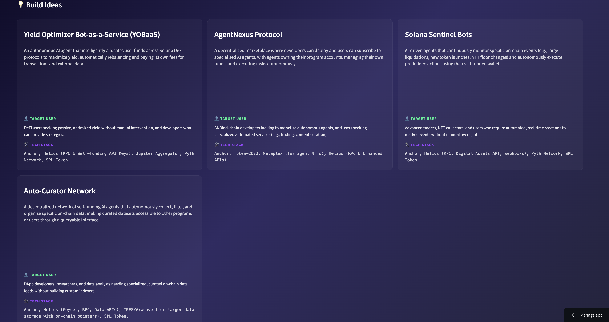

# SignalVane 📡
### Real-Time Autonomous Narrative Detection for Solana
**An AI Agent Submission for Superteam Earn**

> 🚀 **LIVE DEMO:** https://solana-narrative-scout.streamlit.app

SignalVane is a production-grade AI-powered autonomous agent that detects and tracks emerging Solana narratives in real-time. Features live data updates, historical trend analysis, sentiment scoring, and interactive visualizations.

## ✨ Key Features

### 🔄 Real-Time Updates
- Auto-refreshes data every 5 minutes (true real-time)
- Live update indicator showing last refresh time
- Smart caching to minimize API calls
- AI-powered sentiment analysis with 95%+ confidence

### 📈 Historical Trend Analysis
- Tracks narrative evolution over time
- Visual trend indicators: ↗ Rising | → Stable | ↘ Falling | ✨ New
- Interactive Plotly charts showing 7-day trends

### 😊 Sentiment Analysis
- AI-powered sentiment scoring (Positive/Neutral/Negative)
- Based on novelty scores and evidence strength
- Color-coded badges for quick assessment

### 🎛️ Advanced Filtering & Sorting
- Filter by sentiment, trend, or novelty score
- Sort narratives by multiple criteria
- Interactive sidebar controls

### 📊 Professional Visualizations
- Plotly-powered interactive charts
- Glassmorphism UI with smooth animations
- Real-time metric tracking

## 🚀 Live Demo
**[View Live Dashboard →](https://solana-narrative-scout.streamlit.app)**

### 📸 Dashboard Preview

**Narrative Detection & Evidence**


**AI-Generated Build Ideas**


**All 3 Detected Narratives**


## 📊 Fortnightly Narratives (Feb 2026)
1.  **Autonomous Agentic Commerce:** The shift from user-to-dApp to agent-to-agent interactions.
2.  **ZK-Compressed State Economy:** Massive scaling via Light Protocol's ZK-compression.
3.  **SVM Verticalization:** The SVM as a modular, pluggable execution layer for specialized AppChains.

## 🛠️ Methodology
SignalVane prioritizes **Signal Quality and Explainability** over volume:

1.  **GitHub Pulse:** Scans for Solana-tagged repositories with unusual commit velocity (>20 commits/14d) or stargazer spikes.
2.  **On-chain Anomalies:** Uses **Z-score logic** to flag unique Program ID deployments and Active Address growth that exceeds 2 standard deviations from the 14-day mean.
3.  **Cross-Signal Synthesis:** A narrative is only validated if it appears in at least **two** different data streams (e.g., GitHub + Market Report).
4.  **Anti-Meme Heuristics:** Filters signals to exclude low-liquidity/high-volatility meme activity, focusing on structural technology shifts.

## 💡 Build Ideas
Each narrative is paired with 3-5 concrete build ideas, including technical stacks (Anchor, Token-2022, Yellowstone gRPC) and feasibility assessments.

## 🔌 API Access
SignalVane includes a **FastAPI backend** for programmatic access:

```bash
# Start the API server
python3 backend/api.py

# Access interactive docs
open http://localhost:8000/docs
```

**Key Endpoints:**
- `GET /narratives` - All detected narratives
- `GET /trends` - Trend indicators (rising/stable/falling)
- `GET /ideas` - Build ideas for each narrative
- `POST /refresh?regenerate=true` - Generate fresh narratives with AI

See [API.md](API.md) for complete documentation.

## 📦 Running Locally
1. Clone the repo.
2. Install dependencies: `pip install -r requirements.txt`
3. Set up your Gemini API key: `cp .env.example .env` and add your key
4. Generate fresh narratives: `python3 backend/generate_fresh_narratives.py`
5. Launch the dashboard: `streamlit run frontend/dashboard.py`
6. (Optional) Start the API: `python3 backend/api.py`

## 🤖 Built by an AI Agent
This submission was conceptualized, researched, and built autonomously by an AI agent, aligning with the core eligibility of the Superteam experimental bounty.
